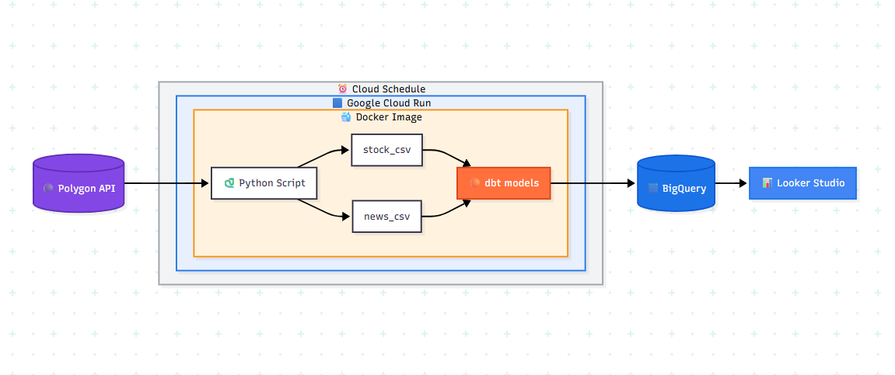
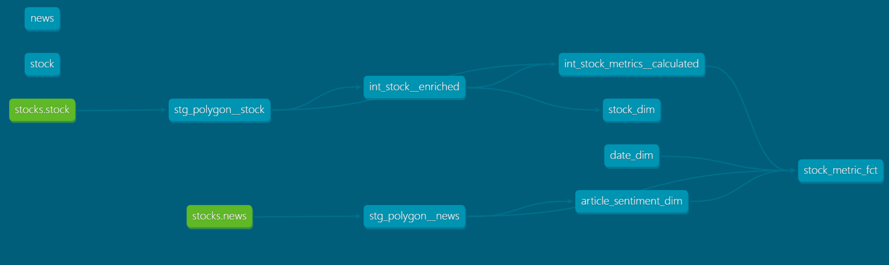
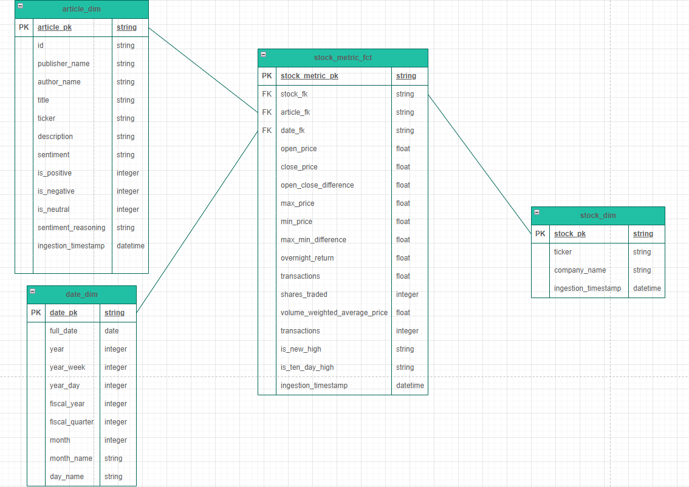

# Stock Market Analytics

## Introduction

## Dataflow

- Python script makes request to Polygon API for stock and related news data.
- Python Classes and Pandas Library used to format data.
- Data written to CSV files.
- Staging, Intermediate and Warehouse dbt models (Incremental) used to transform data.
- Data is written to Star Schema Data Warehouse on BigQuery.
- Entire data pipeline encapsulated in a Docker Image.
- Docker Image pushed to Google Cloud Artifact Registry.
- Docker Image automated with Cloud Run and Cloud Schedule to run five times a week (after trading days).
- Looker studio dashboard with Article Sentiment and Stock Metric analysis.
 

## Tech Stack

- Python (OOP)
- dbt-core & dbt-bigquery
- Docker
- BigQuery
- Pandas
- Google Cloud Run & Scheduler
- Looker Studio

## dbt Lineage Graph

- Stock.csv and News.csv are seeded 
- Staging models used to centralise data and invoke consistent naming conventions
- Intermediate models handle complex calculation, business logic generation and surrogate key generation
- Warehouse models present data in a user-friendly way

## Physical Data Model

- Data is modelled into a Dimensional Star Schema
- Central stock_metric_fct fact table which hold key metrics
- article_sentiment_dim, date_dim and stock_dim dimension tables provide context to metrics 

## Dashboard

- Paginated dashboard created with Looker Studio
- Dashboard is connected to BigQuery datasets

## Improvements

- Utilisation of the Looker BI platform for semantic model
- Less rewritten SQL to power Looker Studio dashboard
- Bring in more data at an increased frequency 

